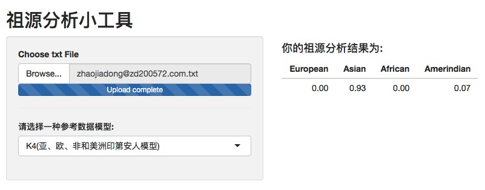

# ancestry-shiny
**Updated 2019-6-8**
Several models worked, using var to solve this. Plan to make it beautiful and better, maybe using shinydashbaord package. 
**Origin**
just a simple shiny app to get your ancestry percent, plan to get several model available, now only global4.  Using wegene radmixture package(admixture R version http://software.genetics.ucla.edu/admixture/). 
https://github.com/wegene-llc/radmixture

You can  simply upload your 23andme or any other formats like this, and soon you will get a result like this below:

